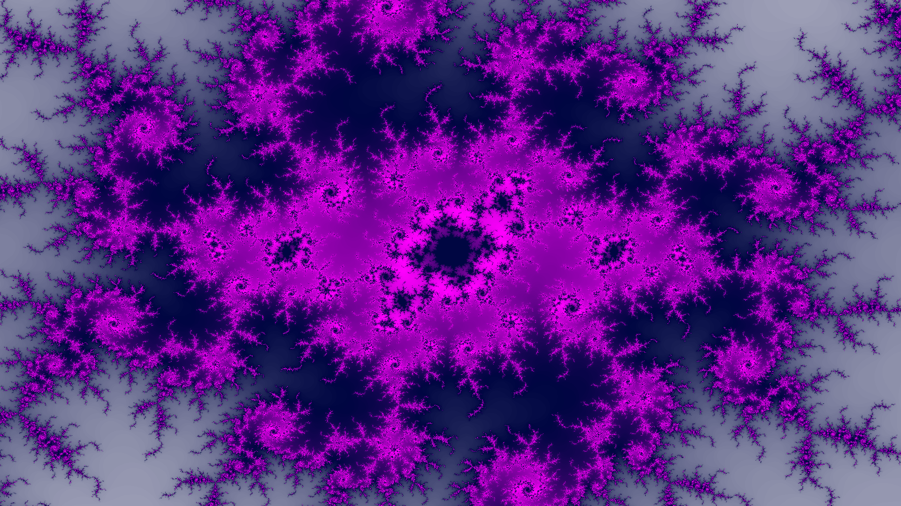
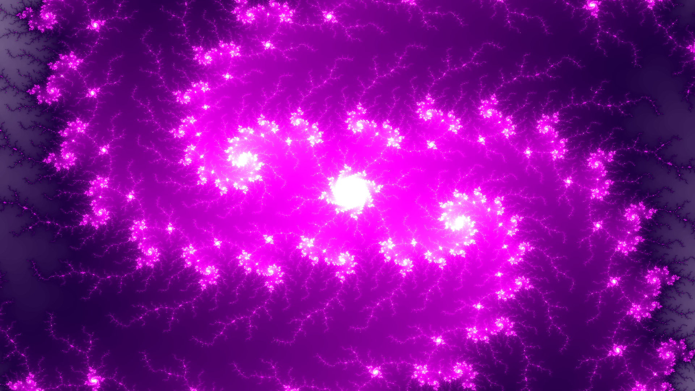
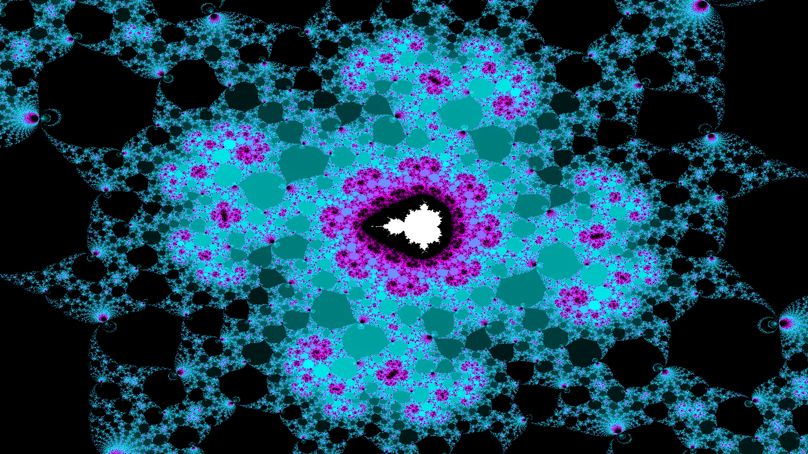
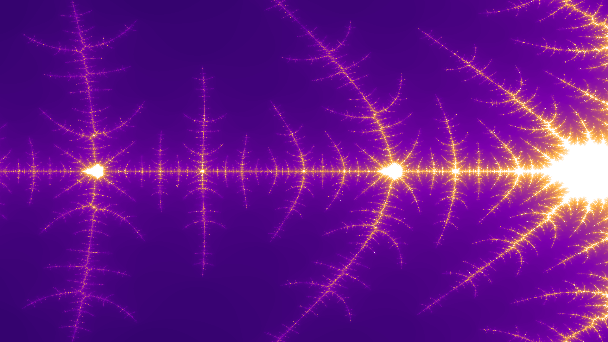
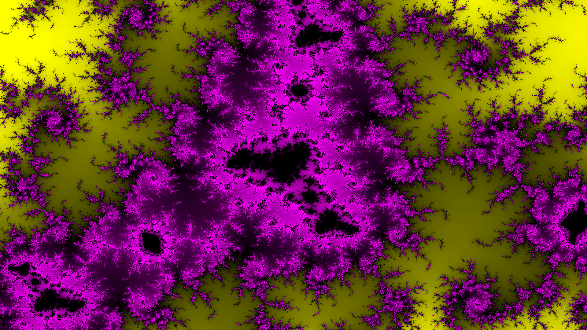

# Rendering Fractals on PYNQ-Z1

Rendering fractals on a PYNQ-Z1 FPGA board using hardware acceleration, developed as part of my 4th year project at Strathclyde.

The project's final report is located in the root folder of this repository and should provide detailed insight into the project. An abstract of the report can be seen below, followed by some screenshots.

## Abstract

Fractal rendering represents a computationally heavy task that requires a lot of raw performance, if satisfying results are to be achieved. The Python productivity for Zynq (PYNQ) project from Xilinx makes it easier to design embedded systems with Xilinx Zynq Systems on Chips, which can be used to perform hardware acceleration of algorithms by processing them on an FPGA programmed with a custom designed digital circuit. Based on a review of various fractals, a Mandelbrot set was selected as a suitable candidate whose rendering should be implemented on an FPGA.

After developing a software solution in Python as a starting point, an intellectual property (IP) block, capable of generating a Mandelbrot fractal images based on given input, was designed using high-level synthesis (HLS) and integrated into an overlay block design used to program the FPGA. The overlay further included a video pipeline with HDMI output capabilities. Custom drivers were designed to facilitate communication between Python code and the FPGA. After undergoing a complex optimisation, the IP achieved more than 2000 times higher performance than the software solution. Additionally, a desktop application with a standalone OpenCL Mandelbrot renderer was developed in Python, which allows a user to connect to the FPGA through an SSH connection and provides an interactive graphical user interface for fractal exploration.

## Screenshots

